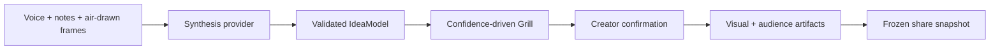

# The Articulator 3000

Turn a rough idea expressed through voice, typing, and air-drawing into a clear,
shareable concept.

The headline interaction is a webcam canvas: MediaPipe tracks the creator's
index finger in the browser, a pinch draws ink over the live video, and selected
composite frames are fused with the transcript. The app then asks a short set of
high-value questions before producing visuals and communication-ready output.

## Why It Stands Out

- **A real multimodal input:** voice, notes, and webcam-space drawings contribute
  to one structured `IdeaModel`.
- **Fast clarification:** the Grill targets the lowest-confidence field and stops
  after three to five questions.
- **Visible payoff:** the result includes a concept image, a cleaned-up drawing,
  a teammate message, and a technical engineering brief.
- **Shareable by design:** frozen, unguessable, `noindex` share pages have rich
  Open Graph cards and can be deleted manually.
- **Reviewable internals:** AI responses are schema-validated, malformed
  synthesis output is retried once, and deterministic decision logic has focused
  unit tests.

## Run The Demo

Prerequisites: a current Node.js LTS release, a webcam, a microphone, and an
OpenAI API key.

```bash
npm ci
cp .env.example .env.local
# Add OPENAI_API_KEY to .env.local
npm run dev
```

Open the URL printed by Next.js, choose **Start**, allow camera and microphone
access, then:

1. Narrate an idea while pinching your thumb and index finger to draw.
2. Add any labels or corrections in the notes field.
3. Answer the Grill's clarification questions.
4. Review and approve the structured interpretation.
5. Generate the visual and audience-specific result, then create a share link.

For the clearest demo, use a physical idea with a moving part and narrate what
each gesture means.

## Architecture



Key modules:

| Area          | Location                   | Responsibility                                                                   |
| ------------- | -------------------------- | -------------------------------------------------------------------------------- |
| Capture       | `components/capture/`      | Coordinates transcription, drawing evidence, and the staged flow                 |
| Air drawing   | `components/airdraw/`      | Client-side MediaPipe tracking, pinch detection, canvas rendering, and keyframes |
| Transcription | `components/transcribe/`   | WebRTC connection using a server-issued ephemeral credential                     |
| Synthesis     | `lib/synthesis/`           | Canonical `IdeaModel`, evidence contract, validation, and retry behavior         |
| Grill         | `lib/grill/`               | Lowest-confidence selection, question limits, and provider prompts               |
| Results       | `components/flow/`         | Confirmation, visuals, audience packages, and sharing                            |
| Sharing       | `lib/share/`, `app/share/` | Validated frozen snapshots, deletion, SSR pages, and Open Graph cards            |

All OpenAI calls that use the real API key run on the server. The browser only
receives a short-lived transcription credential. AI outputs and share payloads
are validated with Zod before use.

## Storage Behavior

When `BLOB_READ_WRITE_TOKEN` is configured, frozen share snapshots are stored in
Vercel Blob. Without it, local development uses an in-memory fallback; those
links are intentionally process-local and disappear when the server restarts.

## Quality Commands

```bash
npm run test        # focused unit and component tests
npm run lint        # ESLint
npm run typecheck   # strict TypeScript
npm run build       # production Next.js build
npm run check       # all of the above plus formatting
npm run format      # apply Prettier
```

## Configuration

See [`.env.example`](./.env.example) for the full list. Only
`OPENAI_API_KEY` is required. Model overrides and Vercel Blob persistence are
optional.

Never place the API key in a `NEXT_PUBLIC_*` variable; Next.js exposes those
variables to the browser.

## Project Docs

- [`CONTEXT.md`](./CONTEXT.md) explains the hackathon goals and deliberate scope.
- [`SPEC.md`](./SPEC.md) records the product contract.
- [`PLAN.md`](./PLAN.md) captures the risk-first implementation order.
- [`TEAM_BRIEF.md`](./TEAM_BRIEF.md) contains the five-minute demo guidance.
